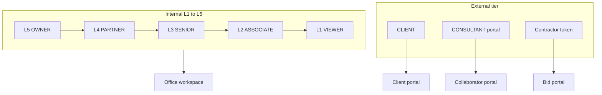

# Access model — levels L1–L5 and external tier

**Status:** Canonical · **Owner:** Holagundi Consulting Works (HCW) · **Reviewed:** 2026-06-19

Single reference for who can see and change what in ESTI. Implementation source:
[`packages/contracts/src/permissions.ts`](../../packages/contracts/src/permissions.ts).

Related: [PRD](PRD.md) · [ARCHITECT-PROFILE](ARCHITECT-PROFILE.md) · [ARCHITECTURE](ARCHITECTURE.md) · [ORG-MODE-AND-HR-ARCHIVE](ORG-MODE-AND-HR-ARCHIVE.md)

---

## Overview

ESTI uses two parallel identity tracks:

1. **Internal staff (L1–L5)** — office workspace; rank-based capabilities.
2. **External tier** — client, consultant, and contractor portals; object-scoped procedures, not on the L1–L5 ladder.

Third-party users never call office (`protectedProcedure`) APIs or see office navigation.



---

## Internal levels (L5 = highest)

| Level | Label | Login role | Rank | Purpose |
| ----- | ----- | ---------- | ---- | ------- |
| **L5** | Firm governance | `OWNER` | 100 | Firm profile, users, settings, compliance audit log, destructive admin |
| **L4** | Commercial leadership | `PARTNER` | 80 | All projects, fees, invoices, HR, GST/TDS reports, project archive |
| **L3** | Project leadership | `SENIOR` | 60 | Delivery writes, invoice draft/issue, **assigned** projects only |
| **L2** | Project operations | `ASSOCIATE`, legacy internal `CONSULTANT` (no `consultantId`) | 40 | Tasks, drawings, documents on assigned or created projects |
| **L1** | Read-only staff | `VIEWER` | 20 | Office read; no operational mutations |

**Legacy internal consultant:** `role = CONSULTANT` with `consultantId` null maps to **L2** (Associate-level office access). External collaborators use the portal track below.

**Project scope (L1–L3 vs L4–L5):** Partner and Owner see all projects. Senior, Associate, and Viewer see projects they are assigned to (via `esti_assignment`) or created. See [`backend/src/lib/projectAccess.ts`](../../backend/src/lib/projectAccess.ts).

---

## External tier (not on L1–L5)

| Class | Identity | Auth | Scope |
| ----- | -------- | ---- | ----- |
| **Client** | `esti_user` + `clientId` | Session cookie | Projects where `projectOffices.clientId` matches; client-visible objects |
| **Consultant** | `esti_user` + `consultantId` | Session cookie | Projects with `esti_engagement` for that consultant |
| **Contractor** | No user row | Tender `accessToken` in URL | Single invitation; site coordination via staff inbox |

| Procedure | Who |
| --------- | --- |
| `clientProcedure` | `CLIENT` with `clientId` |
| `collaboratorProcedure` | `CONSULTANT` with `consultantId` |
| `publicProcedure` + token | Contractor bid portal |

Provisioning:

- **Client portal login** — `clients.createPortalUser` (staff L5 via `firm:admin`)
- **Consultant login** — `consultants.createLogin`
- **Contractor** — tender invitation token; no login row

---

## Capabilities (minimum level)

Capabilities refine access within the office workspace. Checked via `can(role, capability)`.

| Capability | Min level | Roles |
| ---------- | --------- | ----- |
| `workspace:view` | L1 | All staff |
| `write` | L2 | Associate and above |
| `invoice:manage` | L3 | Senior and above |
| `invoice:delete` | L4 | Partner, Owner |
| `fees:manage` | L4 | Partner, Owner |
| `project:delete` | L4 | Partner, Owner |
| `hr:manage` | L4 | Partner, Owner |
| `reports:view` | L4 | Partner, Owner |
| `firm:admin` | L5 | Owner only |

Code helpers: `accessLevelForRole()`, `minLevelForCapability()`, `accessLabelForUser()`.

---

## Information access matrix

Minimum internal level for each domain. External column = portal-scoped only.

| Domain | L1 | L2 | L3 | L4 | L5 | External |
| ------ | -- | -- | -- | -- | -- | -------- |
| Office workspace | Read | Write | Write | Write | Write | No |
| Project list | Assigned | Assigned | Assigned | All | All | Portal scope |
| Drawings / docs / tasks | Read | Write | Write | Write | Write | Assigned |
| Fees / contracts | — | — | — | R/W | R/W | — |
| Invoices / costing tab | — | — | R/W | R/W | R/W | — |
| HR / team | — | — | — | R/W* | R/W* | — |
| GST / reconcile / filing | — | — | — | Read | R/W | — |
| Users / firm settings | — | — | — | — | R/W | — |
| Compliance audit log (`esti_audit`) | — | — | — | — | Read | — |
| Knowledge Bank | Read | Read | Read | Read | Read | — |
| PMC / site coordination | Read | Write | Write | Write | Write | Contractor RFIs |
| Search | Scoped | Scoped | Scoped | Firm-wide | Firm-wide | Portal-scoped |
| File uploads | Blocked | Write† | Write† | Write† | Write† | Blocked |

\* Requires `orgSettings.hrEnabled` (studio mode).  
† Subject to firm upload-password gate when enabled.

**Audit log (L5 only):** Append-only `esti_audit` is restricted to Owner (`firm:admin`) — stricter than GST reports (`reports:view`, L4). Partners can run filing abstracts but cannot browse the full mutation audit trail.

---

## Enforcement layers

| Layer | What | Implementation |
| ----- | ---- | -------------- |
| **1 — Nav / routes** | Top-level IA | [`frontend/src/App.tsx`](../../frontend/src/App.tsx), `useCapabilities()` |
| **2 — API** | Mutations and reads | `protectedProcedure`, `capabilityProcedure`, portal procedures |
| **3 — Project tabs** | Costing, Team, PMC | [`frontend/src/routes/ProjectDetail.tsx`](../../frontend/src/routes/ProjectDetail.tsx) |
| **4 — Row scope** | Project / client / engagement filters | `projectAccess.ts`, portal routers |

**Deferred:** Per-project RBAC (ROADMAP 17E) — e.g. PROJECT_LEAD edits fees on one project only.

---

## tRPC procedure ladder

```
publicProcedure
  └─ authedProcedure
       ├─ protectedProcedure          (office staff L1–L5 + legacy internal CONSULTANT)
       │    ├─ capabilityProcedure(cap)
       │    └─ ownerProcedure         (= firm:admin, L5)
       ├─ clientProcedure            (CLIENT + clientId)
       ├─ collaboratorProcedure      (CONSULTANT + consultantId)
       └─ companionWriteProcedure    (staff write + ESTICAD device token)
```

Contractor bid portal uses `publicProcedure` with invitation token validation.

---

## Cross-cutting modifiers

| Modifier | Effect |
| -------- | ------ |
| `orgSettings.hrEnabled` | Hides Team, HR, Performance nav and blocks team API writes when false |
| `orgSettings.pmcEnabled` | Firm PMC module; per-project `pmcEnabled` also required |
| `orgSettings.orgMode` | `SOLO` vs `STUDIO` — legal/GST only for `firmType`; module gating via `hrEnabled` |
| Demo policy | [`backend/src/lib/demo-policy.ts`](../../backend/src/lib/demo-policy.ts) — restricts uploads, AI, credential admin on demo accounts |
| Upload password | Optional firm gate on file uploads (Company → Upload protection) |

---

## Demo persona → level mapping

Studio demo (`pnpm seed:demo`):

| Login | Level | Role |
| ----- | ----- | ---- |
| `principal@demo.aorms.in` | L5 | OWNER |
| `lead@demo.aorms.in` | L4 | PARTNER |
| `site@demo.aorms.in` | L2 | ASSOCIATE |
| `junior@demo.aorms.in` | L1 | VIEWER |
| `intern@demo.aorms.in` | L1 | VIEWER |
| `client@demo.aorms.in` | External — Client | CLIENT |

---

## Team roles vs access level

`esti_teammember.role` (`TeamRole`) and `esti_assignment.role` (`AssignmentRole`) describe **job titles and project assignments** — they do not grant login permissions. Access level comes only from `esti_user.role` and portal scope fields.
