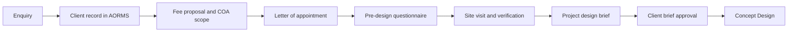

# HOLAGUNDI Architects — Client Onboarding

**Status:** Firm practice guide · **Owner:** Holagundi Consulting Works · **Reviewed:** 2026-06-15

This guide defines how HOLAGUNDI Architects welcomes a new client, collects
pre-design information, and prepares the project for the **Initiation & Brief**
stage in AORMS.

The master data-capture form is the [Pre-Design Questionnaire](PROJECT-BRIEFING.md#pre-design-questionnaire)
in `PROJECT-BRIEFING.md`.

---

## Purpose

Client onboarding ensures that:

1. The firm and client agree on scope, fees, and appointment terms **before** design labour begins.
2. Site, program, lifestyle, and aesthetic preferences are captured in a **single structured record**.
3. The design team can produce a **Project Design Brief** — the authoritative input for Concept Design.

Onboarding is **not** statutory approval, tendering, or construction administration. It ends when the client brief is confirmed and the project moves to Concept Design.

---

## When to use

| Stage | AORMS phase | Onboarding activity |
| --- | --- | --- |
| Enquiry received | — | Create client record; log first communication |
| Fee discussion | — | Draft fee proposal; share COA scope |
| Appointment | **Phase 0 — Appointment** | Site visit; letter of appointment; advance if applicable |
| Brief capture | **Initiation & Brief** | Send questionnaire; compile design brief |
| Design start | **Concept Design** | Brief signed off; concept work begins |

Send the questionnaire **after** the client accepts the proposal in principle and **before** or **during** the first structured briefing meeting — never after Concept Design has started without a recorded change.

---

## Onboarding workflow

### Step 1 — Create the client

1. Open **Clients** and add the client (name, contact, billing address if known).
2. Log the enquiry source and first meeting in the **communication log**.
3. If portal access is required later, provision it only after appointment — not at enquiry.

### Step 2 — Open the project (Appointment phase)

1. Create a **project** linked to the client; set type, location, and tentative built-up area if stated.
2. On the project **Appointment** panel:
   - Record **site visit date**.
   - Capture an initial **scope summary** (residential / commercial, new build / renovation, phases, budget band).
3. Issue or draft the **letter of appointment** from **Office → Documents** (template library).
4. Link the **fee proposal** from **Accounting → Fees**.
5. Mark **Appointment complete** only when agreement and advance (if any) are recorded.

### Step 3 — Issue the Pre-Design Questionnaire

1. Send the client the questionnaire from [PROJECT-BRIEFING.md](PROJECT-BRIEFING.md#pre-design-questionnaire).
2. Preferred delivery:
   - **PDF or print** for in-person briefing (recommended for first residential projects).
   - **Editable document** returned by email; staff transcribe into AORMS.
   - **Briefing meeting** — walk through sections 1–11 together; complete room templates (sections 12+) in a second session if needed.
3. Set expectation: incomplete sections delay Concept Design; critical gaps (site dimensions, budget, occupant count, Vastu stance) must be filled before brief sign-off.

### Step 4 — Site visit and verification

Cross-check questionnaire answers against site reality:

| Questionnaire field | Site verification |
| --- | --- |
| Terrain, vegetation, orientation | Walk the plot; note levels, trees, views, noise |
| Size / dimensions | Measure or confirm survey dimensions |
| Natural features, soil | Photograph; note drainage, rock, retaining needs |
| Access and services | Road width, power/water/sewer availability |

Record discrepancies in the project **internal notes** and update the questionnaire before briefing compilation.

### Step 5 — Briefing meeting

1. Review completed questionnaire with the client (Principal or Senior lead).
2. Clarify contradictions (e.g. open plan vs separate rooms, basement use, staff quarters).
3. Confirm **budget excluding legal fees**, **phasing**, and **tentative start date**.
4. Agree which **room templates** apply (duplicate the room template per space in PROJECT-BRIEFING).

### Step 6 — Compile and approve the Project Design Brief

Follow [PROJECT-BRIEFING.md — Compiling the design brief](PROJECT-BRIEFING.md#compiling-the-design-brief).

Store the approved brief in AORMS using the [PROJECT-BRIEFING AORMS mapping](PROJECT-BRIEFING.md#aorms-mapping):

- **Project Info** tab — questionnaire sections §1–§11, assumptions, and client approval note.
- **Appointment → scope summary** — executive summary for proposals.
- **Documents** — optional issued letter or signed brief PDF.
- Inputs to **specification preferences** and **Initiation & Brief** tasks.

Obtain explicit **client approval** (approval record or signed brief PDF) before advancing to Concept Design.

---

## Client communication checklist

Use this checklist before closing onboarding:

- [ ] Client record complete (name, address, mobile, email)
- [ ] Site address distinct from correspondence address if different
- [ ] Fee proposal issued and accepted
- [ ] Letter of appointment signed
- [ ] Appointment phase marked complete in AORMS
- [ ] Pre-design questionnaire returned (all mandatory sections)
- [ ] Site visit completed; site notes reconciled with form
- [ ] Occupant and staff table completed
- [ ] Space requirements table filled for all required rooms
- [ ] Material preferences captured (or marked “to develop in Concept”)
- [ ] Room templates completed for entrance, living, kitchen, dining, and all bedrooms
- [ ] Vastu requirement confirmed (yes/no/consultant named)
- [ ] Project design brief entered on **Project Info** tab and client-approved
- [ ] Concept Design phase authorized

---

## Roles

| Role | Responsibility |
| --- | --- |
| **Owner / Partner** | Appointment, fee acceptance, brief sign-off |
| **Senior architect** | Questionnaire review, briefing meeting, design brief authorship |
| **Associate** | Transcription into AORMS, room template collation, site visit notes |
| **Admin** | Client record, questionnaire dispatch, appointment scheduling |

---

## Privacy and records

- Questionnaires contain personal and financial data — restrict to project team and **STAFF** visibility in AORMS.
- Do not share one client’s preferences or budget with other clients or contractors.
- Retain signed questionnaires with the project archive per firm retention policy.

---

## Related AORMS locations

| Onboarding artefact | AORMS module |
| --- | --- |
| Client identity | **Clients** |
| First contact | Client **communication log** |
| Site visit, scope summary | Project **Appointment** |
| Fee and COA scope | **Fee proposals** / **Proposals** |
| Appointment letter | **Office → Documents** (letter template) |
| Questionnaire responses | Transcribed into **Project design brief** (see PROJECT-BRIEFING) |
| Brief approval | **Approvals** or issued brief PDF in **Documents** |
| Concept inputs | **Specifications**, **Tasks** (Initiation & Brief) |

---

## Document control

| Version | Date | Change |
| --- | --- | --- |
| 1.0 | 2026-06-15 | Initial guide aligned to HOLAGUNDI Pre-Design Questionnaire |
